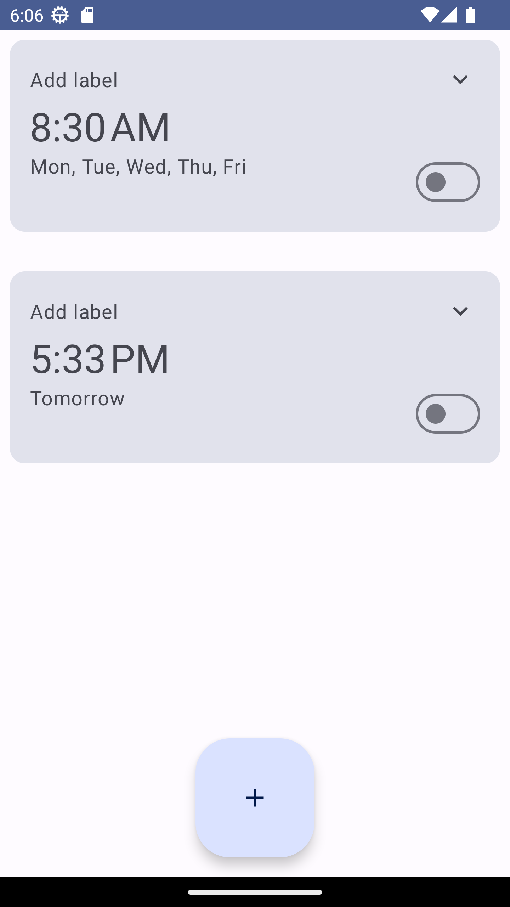

# alarmer
This is an alarm app
- target API: 34

# intuitive
- UI: Material 3, Stateflow
- Controller: ViewModel
# images

# resources
- [AOSP Alarm App](https://cs.android.com/android/platform/superproject/main/+/main:packages/apps/DeskClock/)
- [Notification](https://developer.android.com/develop/ui/views/notifications)
- [Alarm Manager](https://developer.android.com/training/scheduling/alarms)
